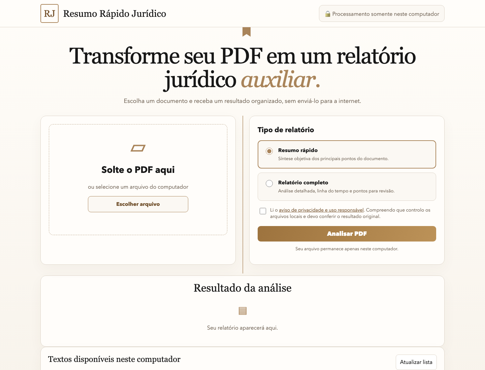

# Resumo Rápido Jurídico

Aplicativo gratuito e local para extrair texto de PDFs e organizar informações jurídicas em relatórios auxiliares. O documento permanece no computador do usuário: não há conta, nuvem, chave de API, telemetria ou envio para serviços externos.

[](https://github.com/fernandajumapacheco/resumo-rapido-juridico/releases/latest)
[](#requisitos)
[](#privacidade-por-arquitetura)



## Download

Baixe a [versão mais recente](https://github.com/fernandajumapacheco/resumo-rapido-juridico/releases/latest) e escolha **Source code (zip)** em **Assets**.

> **Uso responsável:** o relatório é uma ferramenta de apoio. Confira nomes, datas, valores, prazos e conclusões diretamente nos autos.

Antes da primeira análise, a interface pede a confirmação de leitura do aviso de privacidade e uso responsável. Isso registra ciência das condições de uso; não é uma tentativa de obter “consentimento LGPD” em nome de quem controla os documentos.

Leia os [Termos de uso, privacidade e LGPD](docs/TERMOS_DE_USO.md).

## O que o programa faz

- Aceita arquivos PDF, Markdown e MARKDOWN.
- Extrai o texto com Python e, quando disponível, usa `pdftotext` como leitor preferencial.
- Pode usar OCR local opcional em PDFs escaneados.
- Produz **Resumo Rápido** ou **Relatório Jurídico Completo**.
- Mascara o número do processo como `xxx` e tenta abreviar nomes de pessoas por iniciais nos relatórios exportados.
- Mostra o resultado no navegador e gera arquivos Markdown, Word e PDF.
- Evita sobrescrever documentos que tenham o mesmo nome.
- Escolhe automaticamente uma porta local livre entre `8787` e `8799`.

## Privacidade por arquitetura

O navegador conversa somente com um servidor Python executado em `127.0.0.1`, isto é, dentro do próprio computador. O programa não contém integração com OpenAI, Ollama ou qualquer serviço remoto.

Os documentos e resultados ficam em `dados/`, uma pasta ignorada pelo Git. As subpastas são criadas automaticamente na primeira execução:

```text
dados/
├── 01_entrada/     PDFs recebidos
├── 02_markdown/    textos extraídos
└── 03_resumos/     relatórios em MD, DOCX e PDF
```

Essas pastas não são incluídas vazias no GitHub por segurança: isso reduz o risco de adicionar documentos jurídicos reais ao repositório por engano.

### LGPD e responsabilidade de quem utiliza

O processamento local reduz a circulação de dados, mas não garante sozinho conformidade com a LGPD. Quem utiliza o programa deve avaliar finalidade, base legal, necessidade, controle de acesso, retenção, descarte e direitos dos titulares. Consulte a [LGPD](https://www.planalto.gov.br/ccivil_03/_ato2015-2018/2018/lei/l13709compilado.htm) e o [guia de segurança da ANPD](https://www.gov.br/anpd/pt-br/centrais-de-conteudo/materiais-educativos-e-publicacoes/guia-orientativo-sobre-seguranca-da-informacao-para-agentes-de-tratamento-de-pequeno-porte).

### Anonimização dos relatórios

Por segurança, os relatórios exportados ocultam números de processo com `xxx`, tentam abreviar nomes de pessoas por iniciais e mascaram padrões comuns de CPF, telefone, e-mail, CEP e endereço.

A anonimização automática é apenas uma proteção auxiliar. Antes de compartilhar qualquer relatório, revise o arquivo e remova manualmente dados pessoais, dados sensíveis, segredo de justiça ou informações desnecessárias.

## Requisitos

- Python 3.11 ou superior.
- macOS, Linux ou Windows com um terminal Python disponível.

O OCR é opcional e possui dependências separadas porque ocupa mais espaço.

## Forma mais simples de usar

1. Baixe o arquivo ZIP da versão mais recente na página de releases.
2. Extraia o ZIP para uma pasta comum do computador.
3. No macOS, abra `INICIAR_MAC.command`.
4. No Windows, abra `INICIAR_WINDOWS.bat`.

Na primeira abertura, o inicializador cria `.venv` e instala as dependências Python. Essa instalação inicial precisa de internet; depois disso, o processamento dos documentos é local.

## Instalação manual no macOS

```bash
python3 -m venv .venv
.venv/bin/pip install -r requirements.txt
```

O Poppler é opcional, mas pode melhorar a extração de alguns PDFs:

```bash
brew install poppler
```

## Instalação manual no Linux Debian ou Ubuntu

```bash
sudo apt-get install python3-venv
python3 -m venv .venv
.venv/bin/pip install -r requirements.txt
```

O pacote `poppler-utils` é opcional.

## Instalação manual no Windows

Instale Python 3.11 ou superior. Depois execute no PowerShell:

```powershell
py -m venv .venv
.venv\Scripts\pip install -r requirements.txt
```

## Como abrir

No macOS ou Linux:

```bash
.venv/bin/uvicorn app:app --host 127.0.0.1 --port 8787
```

No Windows:

```powershell
.venv\Scripts\uvicorn app:app --host 127.0.0.1 --port 8787
```

Abra [http://127.0.0.1:8787](http://127.0.0.1:8787) no navegador. Esse endereço é local e não publica o programa na internet.

## OCR opcional

Para PDFs formados apenas por imagens:

```bash
.venv/bin/pip install -r requirements-ocr.txt
```

No Windows, troque `.venv/bin/pip` por `.venv\Scripts\pip`.

## Testes

O teste integral cria um PDF totalmente fictício em uma pasta temporária, executa os dois modos e valida os três formatos de saída:

```bash
.venv/bin/python tests/verificar_integracao.py
```

Para recriar os exemplos públicos:

```bash
.venv/bin/python scripts/gerar_exemplos.py
```

Nenhum documento pessoal é necessário para testar o projeto.

## Estrutura do repositório

```text
resumo-rapido-juridico/
├── analise_juridica.py       motor determinístico
├── app.py                    servidor Python local
├── iniciar.py                escolhe uma porta livre e abre o navegador
├── exportar_relatorio.py     criação de DOCX e PDF
├── INICIAR_MAC.command       abertura assistida no macOS
├── INICIAR_WINDOWS.bat       abertura assistida no Windows
├── web/index.html            interface local
├── web/termos.html           aviso exibido pela interface
├── exemplos/                 documento e resultados fictícios
├── scripts/                  geração reproduzível dos exemplos
├── tests/                    verificações automatizadas
├── docs/                     interface e privacidade
├── docs/BASE_PECAS_JURIDICAS.md base informativa de peças e documentos
├── requirements.txt          dependências principais
└── requirements-ocr.txt      dependências opcionais de OCR
```

## Segurança

- Não adicione processos reais, relatórios pessoais, certificados, chaves ou arquivos `.env` ao repositório.
- Não altere o host para `0.0.0.0` em computadores que armazenem documentos sigilosos.
- Use um computador protegido e mantenha backups apropriados dos documentos originais.
- Revise o resultado antes de utilizá-lo em qualquer atividade jurídica.

Consulte [SECURITY.md](SECURITY.md) para relatar uma vulnerabilidade sem expor dados sensíveis.

Consulte também [docs/TERMOS_DE_USO.md](docs/TERMOS_DE_USO.md) antes de utilizar documentos reais.

## Limitações conhecidas

A análise é determinística: ela localiza padrões e trechos relevantes, mas não compreende o processo como uma pessoa. Qualidade do OCR, formatação incomum e erros no documento original podem afetar o resultado. O programa não oferece aconselhamento jurídico e não garante exatidão.

## Licença

Nenhuma licença de reutilização foi concedida nesta versão inicial. O código pode ser visualizado no repositório público, mas permanece protegido pelos direitos autorais aplicáveis até que a autora escolha uma licença.
